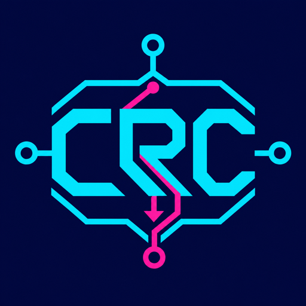

# CRC@CSAW 2026

The inaugural Cyber Reasoning Challenge at CSAW is a student competition on autonomous vulnerability discovery and repair.

Teams build a cyber reasoning system that analyzes a vulnerable open-source target, produces a valid proof of vulnerability, and submits a source patch. A successful patch must compile, pass the target's functional tests, and neutralize the discovered vulnerability.

## Participant repositories

- [CRC-Template](https://github.com/Secure-Reasoning-Lab/CRC-Template): starter repository for building and locally testing a Finder/Patcher CRS, with Claude Code and Codex examples.
- [CRC-Evaluate](https://github.com/Secure-Reasoning-Lab/CRC-Evaluate): evaluation harness for validating submissions, running Finder/Patcher benchmarks, and verifying results.

## Competition format

CRC@CSAW follows a find-then-patch format:

1. **Find:** submit an input that reliably triggers the intended vulnerability.
2. **Patch:** submit a source diff that fixes the vulnerability without breaking expected behavior.
3. **Verify:** organizer-side grading checks the proof and applies the build, test, and security gates.

Challenges use two scan modes:

- **Delta scan:** the vulnerable change is provided as a diff.
- **Full scan:** the complete vulnerable project is provided without a localization hint.

The inaugural event focuses on C and C++ targets evaluated with AddressSanitizer.

## Eligibility

- Teams consist of one to four current college or university students.
- A team may list one faculty or staff advisor.
- Each participant may compete on only one team.

## Event links

- [Registration](https://docs.google.com/forms/d/e/1FAIpQLScyYxAInuka-A1ehkU9fKZ57NKgpFvhjLEDLJNV4oaBQEQFZg/viewform?usp=preview)
- [Discord](https://discord.gg/QaDhQs7CN)
- [CSAW](https://www.csaw.io/)

## Repository guide

- [`docs/competition-format.md`](docs/competition-format.md): participant-facing format and scoring
- [`docs/getting-started.md`](docs/getting-started.md): software stack and preparation
- [`docs/timeline.md`](docs/timeline.md): event milestones
- [`RULES.md`](RULES.md): competition rules
- [`SUBMISSION.md`](SUBMISSION.md): required submission artifacts
- [`challenges/`](challenges/): released challenge statements
- [`leaderboard/`](leaderboard/): official standings

Official announcements are posted in this repository and in the CRC@CSAW Discord.
